# 🇱🇰 Colombo Suburban Traffic Index

An index measuring traffic conditions between Colombo and its immediate suburbs.

## Definitions, Vision and Big-Picture

See [The Colombo Traffic Index (CTI) - Understanding the Bigger Picture](README.VISION.md)

## Colombo Traffic Index (CTI) = 1.60x

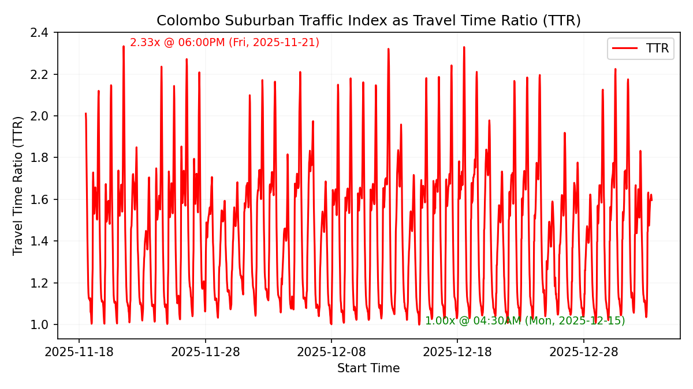

### Average CTI by Time of Day

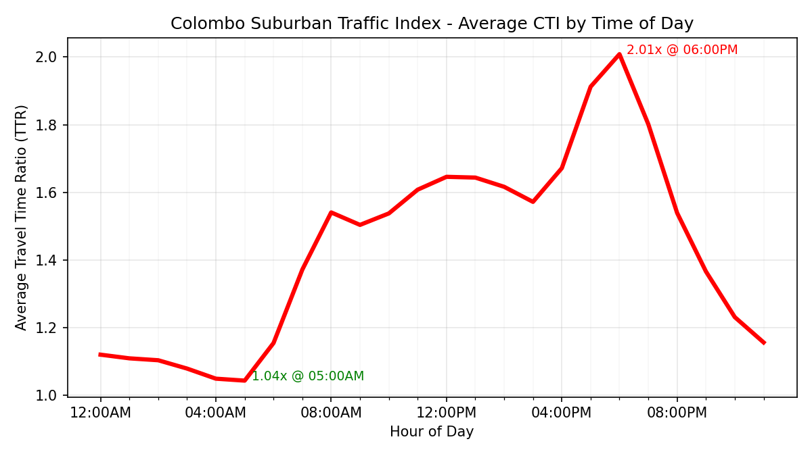

### Average Speed by Day of Week

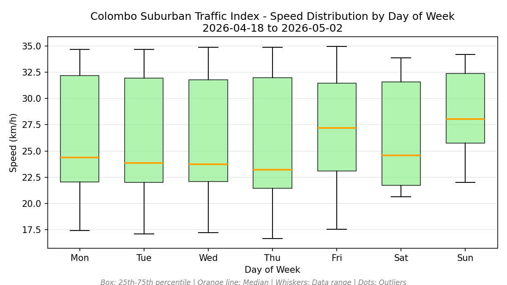

### Overall Direct Speed (ODS)

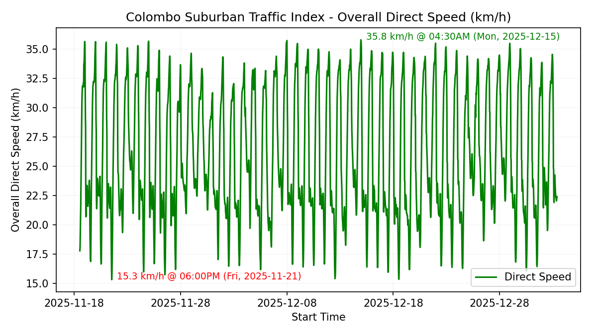

## Routes

The current version uses routes between the following locations:

1. [Kandana](https://www.google.com/maps/place/7.046582,79.897177/): Cross Junction (A3), Kandana
2. [Mattakkuliya](https://www.google.com/maps/place/6.980032,79.875507/): Southside of Mattakkuliya Bridge, on New Negombo Road (Colombo 15)
3. [Kiribathgoda](https://www.google.com/maps/place/6.978204,79.927275/): Kiribathgoda Junction (A1/B221), Kiribathgoda
4. [Dematagoda](https://www.google.com/maps/place/6.943065,79.878269/): Southside of Dematagoda Canal Bridge, on A1/Baseline Road (Colombo 9)
5. [Kaduwela](https://www.google.com/maps/place/6.935664,79.984206/): Kaduwela Junction (AB4/AB10/B263), Kaduwela
6. [Borella](https://www.google.com/maps/place/6.910838,79.887858/): Ayurveda Junction on Sri Jayewardenepura Mawatha (Colombo 8)
7. [Aturugiriya](https://www.google.com/maps/place/6.877227,79.989877/): Aturugiriya Junction (B174/B240), Aturugiriya
8. [Pamankada](https://www.google.com/maps/place/6.871813,79.884564/): High Level Road border of CMC (Colombo 6)
9. [Wellawatte](https://www.google.com/maps/place/6.863366,79.863589/): Northside of Dehiwala Bridge, on Galle Road (Colombo 6)
10. [Kottawa](https://www.google.com/maps/place/6.841647,79.964492/): Kottawa Junction (A4/B239), Kottawa
11. [Piliyandala](https://www.google.com/maps/place/6.801780,79.922719/): Piliyandala Junction (B84/B367), Piliyandala
12. [Moratuwa](https://www.google.com/maps/place/6.788030,79.885045/): Rawathawatta Junction (A2/B295), Moratuwa

### Route Map

The map below shows all monitored routes connecting these locations:

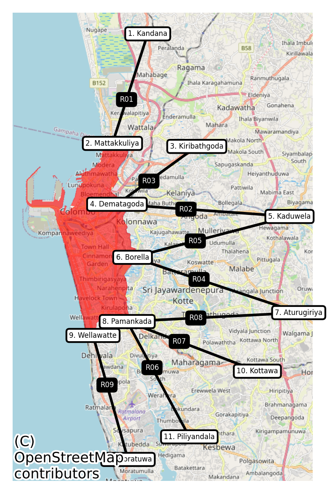

### Direct Speed by Route

#### R01. [Mattakkuliya ↔ Kandana](https://www.google.com/maps/dir/6.980032,79.875507/7.046582,79.897177/)

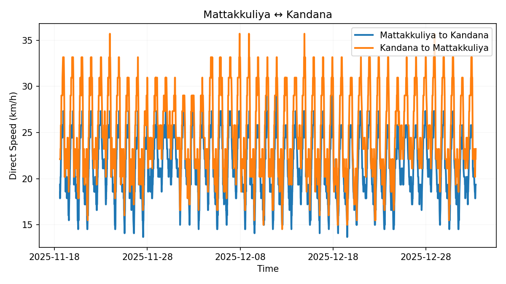

#### R02. [Dematagoda ↔ Kaduwela](https://www.google.com/maps/dir/6.943065,79.878269/6.935664,79.984206/)

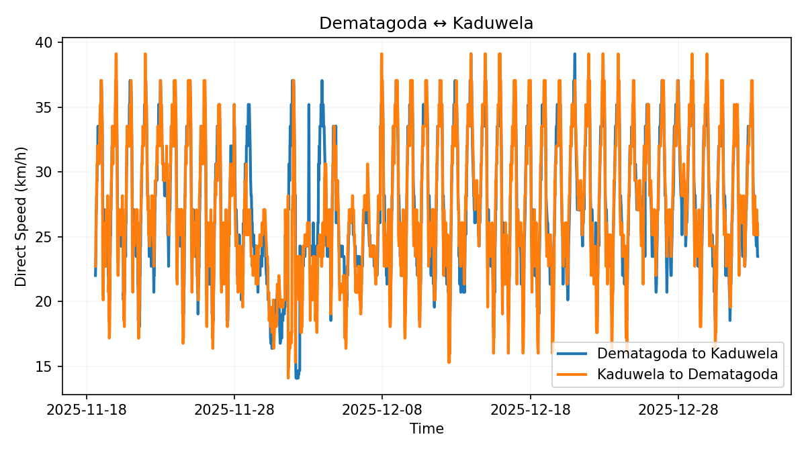

#### R03. [Dematagoda ↔ Kiribathgoda](https://www.google.com/maps/dir/6.943065,79.878269/6.978204,79.927275/)

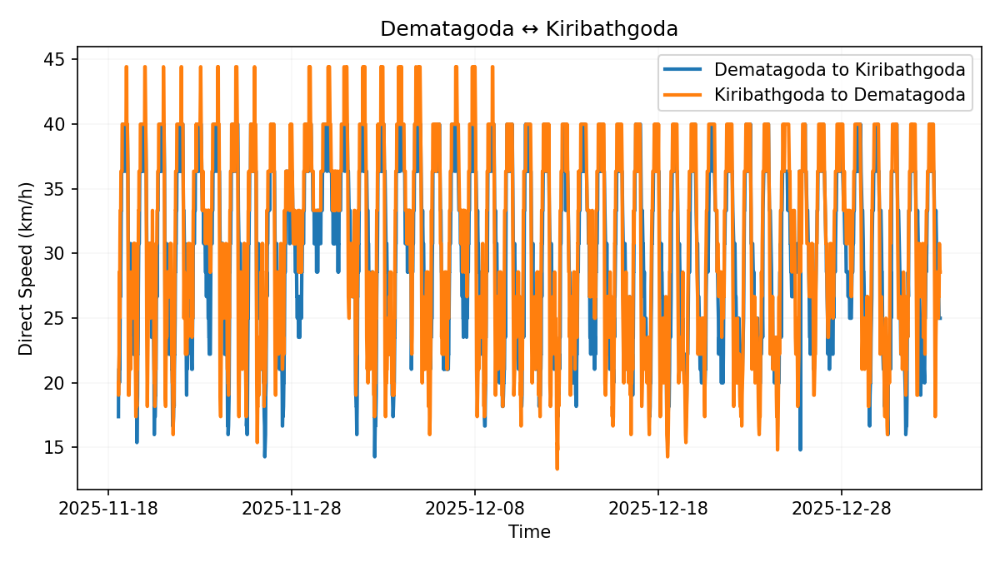

#### R04. [Borella ↔ Aturugiriya](https://www.google.com/maps/dir/6.910838,79.887858/6.877227,79.989877/)

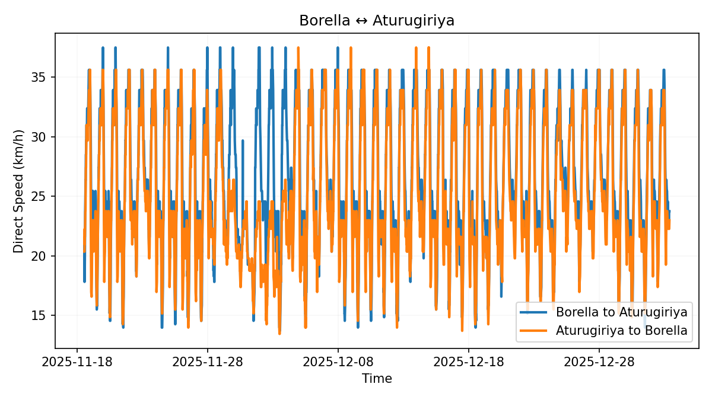

#### R05. [Borella ↔ Kaduwela](https://www.google.com/maps/dir/6.910838,79.887858/6.935664,79.984206/)

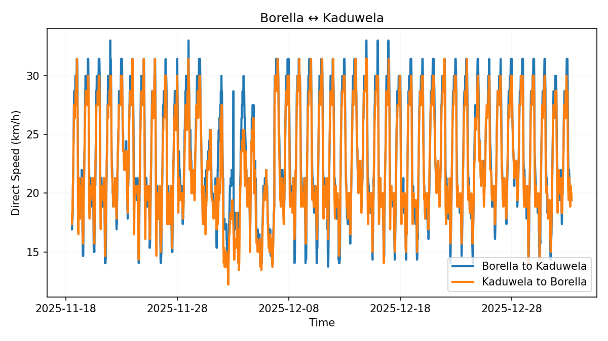

#### R06. [Pamankada ↔ Piliyandala](https://www.google.com/maps/dir/6.871813,79.884564/6.801780,79.922719/)

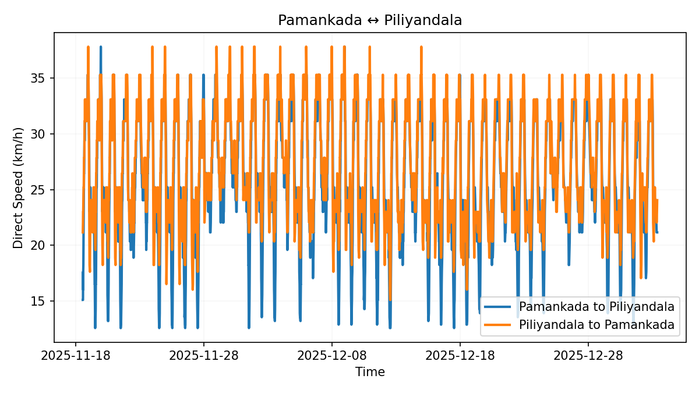

#### R07. [Pamankada ↔ Kottawa](https://www.google.com/maps/dir/6.871813,79.884564/6.841647,79.964492/)

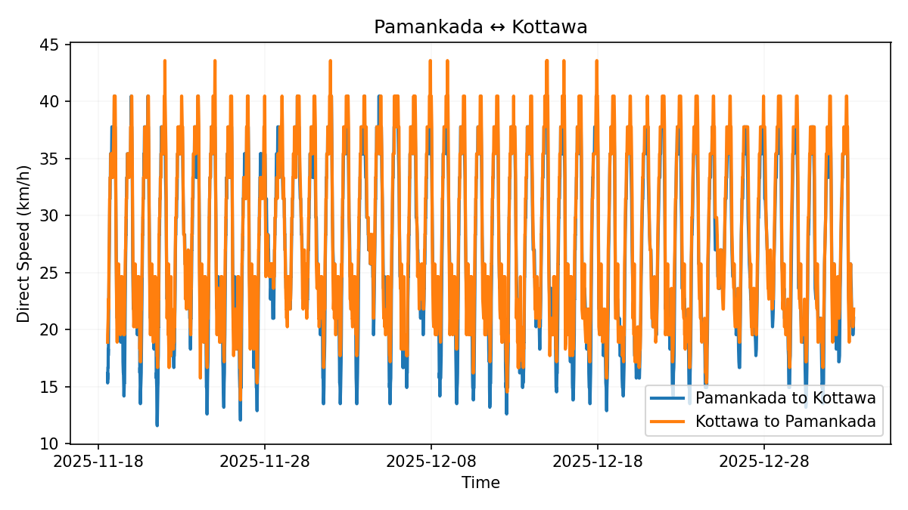

#### R08. [Pamankada ↔ Aturugiriya](https://www.google.com/maps/dir/6.871813,79.884564/6.877227,79.989877/)

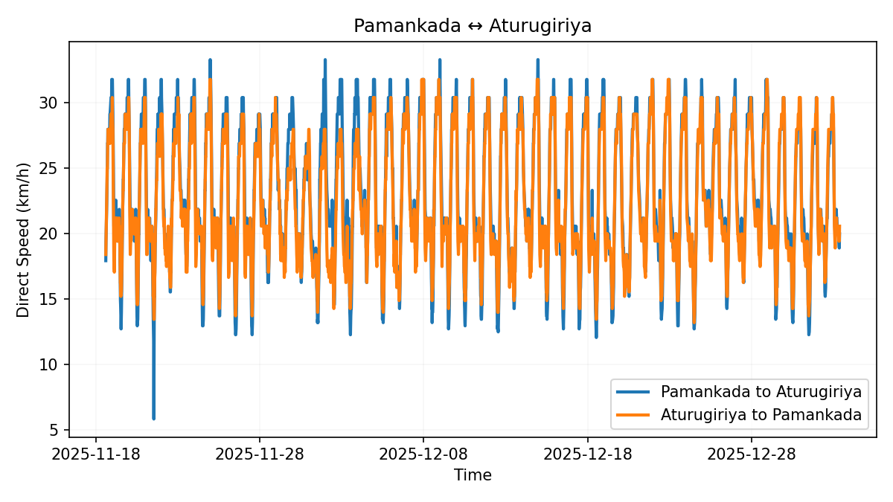

#### R09. [Wellawatte ↔ Moratuwa](https://www.google.com/maps/dir/6.863366,79.863589/6.788030,79.885045/)

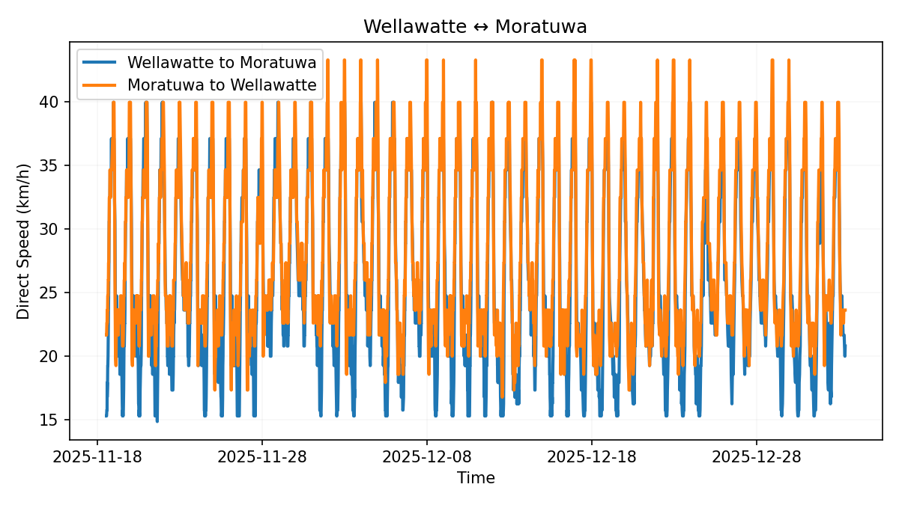

