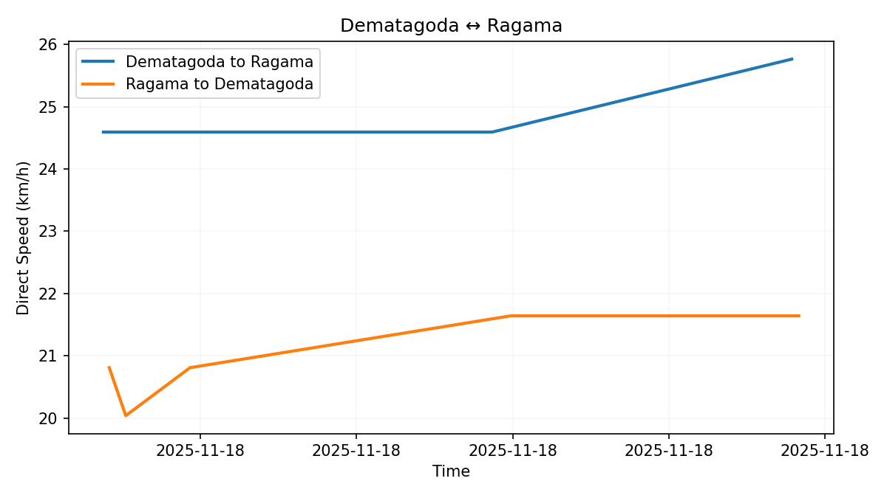

# 🇱🇰 Colombo Suburban Traffic Index

An index measuring traffic conditions between Colombo and its immediate suburbs.

## Definitions, Vision and Big-Picture

See [The Colombo Traffic Index (CTI) - Understanding the Bigger Picture](README.VISION.md)

## Colombo Traffic Index (CTI) = 1.00x

### Average CTI by Time of Day

### Average Speed by Day of Week

### Overall Direct Speed (ODS)

## Routes

The current version uses routes between the following locations:

1. [Ragama](https://www.google.com/maps/place/7.021771,79.899585/): Mahabage Junction (A3/B240), Ragama
2. [Kiribathgoda](https://www.google.com/maps/place/6.978204,79.927275/): Kiribathgoda Junction (A1/B221), Kiribathgoda
3. [Dematagoda](https://www.google.com/maps/place/6.943065,79.878269/): Southside of Dematagoda Canal Bridge, on A1/Baseline Road (Colombo 9)
4. [Kaduwela](https://www.google.com/maps/place/6.935664,79.984206/): Kaduwela Junction (AB4/AB10/B263), Kaduwela
5. [Borella](https://www.google.com/maps/place/6.910838,79.887858/): Ayurveda Junction on Sri Jayewardenepura Mawatha (Colombo 8)
6. [Aturugiriya](https://www.google.com/maps/place/6.877227,79.989877/): Aturugiriya Junction (B174/B240), Aturugiriya
7. [Pamankada](https://www.google.com/maps/place/6.871813,79.884564/): High Level Road border of CMC (Colombo 6)
8. [Wellawatte](https://www.google.com/maps/place/6.863366,79.863589/): Northside of Dehiwala Bridge, on Galle Road (Colombo 6)
9. [Kottawa](https://www.google.com/maps/place/6.841647,79.964492/): Kottawa Junction (A4/B239), Kottawa
10. [Piliyandala](https://www.google.com/maps/place/6.801780,79.922719/): Piliyandala Junction (B84/B367), Piliyandala
11. [Moratuwa](https://www.google.com/maps/place/6.788030,79.885045/): Rawathawatta Junction (A2/B295), Moratuwa

### Route Map

The map below shows all monitored routes connecting these locations:

### Direct Speed by Route

#### R01. [Dematagoda ↔ Kiribathgoda](https://www.google.com/maps/dir/6.943065,79.878269/6.978204,79.927275/)

#### R02. [Dematagoda ↔ Ragama](https://www.google.com/maps/dir/6.943065,79.878269/7.021771,79.899585/)

#### R03. [Borella ↔ Aturugiriya](https://www.google.com/maps/dir/6.910838,79.887858/6.877227,79.989877/)

#### R04. [Borella ↔ Kaduwela](https://www.google.com/maps/dir/6.910838,79.887858/6.935664,79.984206/)

#### R05. [Pamankada ↔ Piliyandala](https://www.google.com/maps/dir/6.871813,79.884564/6.801780,79.922719/)

#### R06. [Pamankada ↔ Kottawa](https://www.google.com/maps/dir/6.871813,79.884564/6.841647,79.964492/)

#### R07. [Wellawatte ↔ Moratuwa](https://www.google.com/maps/dir/6.863366,79.863589/6.788030,79.885045/)

