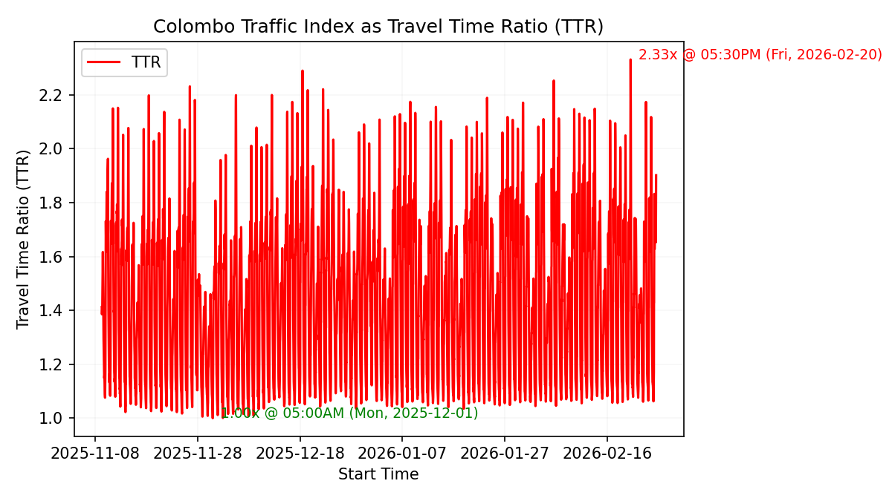
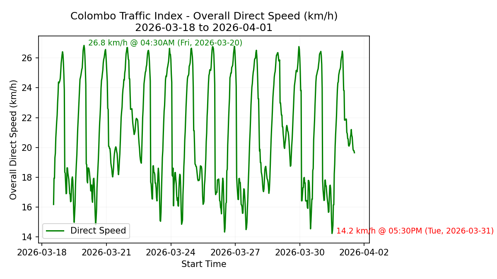
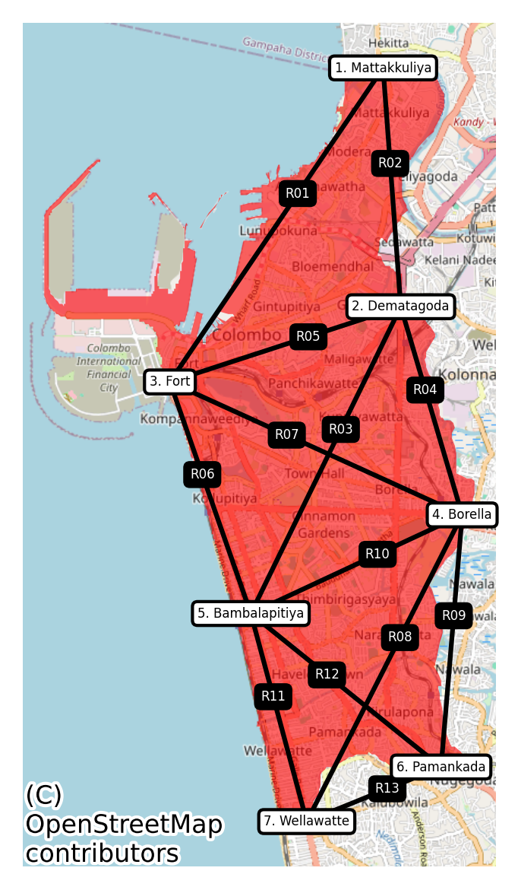

# The Colombo Traffic Index (CTI)

## Understanding the Bigger Picture

Colombo’s roads often feel unpredictable, but what if we could turn that chaos into insight? 

The Colombo Traffic Index (CTI) will aim to do just that, creating a single number that represents how traffic is flowing across Colombo at any given moment.

In this first version, the focus will be on the 37 square kilometre area overseen by the Colombo Municipal Council, the urban core that includes all addresses from Colombo 1 to Colombo 15. Future versions could extend this idea to nearby urban areas such as Dehiwala–Mount Lavinia, Kotte, and Gampaha, and, eventually, the entire island.

The CTI is not about helping drivers navigate daily traffic locally or explaining why one junction is jammed. It is about understanding the bigger picture: how this defined urban area moves, how it slows down, and what that means for Colombo’s economy, environment, and way of life.

## How the CTI Will Work

The CTI will represent a number that reflects how efficiently traffic is flowing across Colombo. It will be defined using a measure called the **Travel Time Ratio (TTR)**, which compares current travel conditions against the best possible ones.

The **TTR** is calculated by dividing the current average travel time between key points by the optimal travel time under free-flow conditions. A TTR of **1.0** means traffic is moving *"as fast as it possibly can"*, while **2.0** means journeys are taking twice as long as they should. The CTI will therefore increase as congestion worsens, offering a clear, intuitive measure of traffic slowdown.

### Overall Direct Speed (ODS)

To support this, a secondary metric—**Overall Direct Speed (ODS)**—will also be computed. This is the inverse of the TTR and represents the average direct speed (in km/h) between key points, defined as straight-line distance divided by actual travel duration. While ODS might be more intuitive, the TTR is more in line with global standards for comparing city traffic and will serve as the official basis for the CTI.

The CTI will be built from Google Maps and comparable data sources, measuring travel times between a small number of key locations within the CMC. The key routes connecting these points will be chosen to give the best possible coverage of overall traffic conditions while keeping the network simple and efficient. This compact design allows the CTI to represent the city’s movement using a small number of observation points.

## What the CTI Will Be and Will Not Be

The CTI will be a summary measure of congestion, not a navigation or routing tool. It will not tell drivers which lane to take or how to reach Town Hall fastest. Instead, it will measure the overall pulse of the Colombo CMC area—how freely or slowly traffic flows at a citywide level.

## Why CTI Will Matter

Once established, the CTI will allow big-picture analysis that has not been possible before. Researchers and policymakers will be able to ask questions such as:

- Is overall traffic in the CMC area worse during certain months of the year?
- How does congestion correlate with GDP growth or air pollution levels?
- Do public holidays, weather patterns, or school terms noticeably change congestion levels?

They could also help identify:

- Which times of day cause the most productivity loss for businesses.
- How fuel consumption and emissions rise during peak hours.
- Whether infrastructure investments, such as flyovers or signal timing changes, deliver real improvement.
- How transport costs influence the city’s economic competitiveness.
- The relationship between traffic, health outcomes, and quality of urban life.
- Scenario out different routing paths around one-way, right turns, railway crossings and key buildings (malls, schools, religious sites, government offices etc.).

These insights will shape how the city is planned and managed. A consistent measure of congestion will help Colombo manage mobility with the same precision used to track inflation or unemployment.

## Concluding Thoughts

In the long term, the CTI could help Colombo answer key questions about its growth: how much time and fuel are wasted in traffic, what the environmental costs of congestion are, and whether policies are making things better.

By turning real-world movement into measurable information, the CTI will transform how we understand traffic—not as random frustration but as a predictable, measurable feature of urban life within the Colombo 1–15 area.

---

## Appendix: Prototype

For Code and Data [https://github.com/nuuuwan/cmb_traffic](https://github.com/nuuuwan/cmb_traffic)

### Routes used in Prototype

1. [Mattakkuliya](https://www.google.com/maps/place/6.980027,79.875513/): Southside of Mattakkuliya Bridge, on New Negombo Road (Colombo 15)
2. [Dematagoda](https://www.google.com/maps/place/6.943176,79.878208/): Southside of Dematagoda Canal Bridge, on A1/Baseline Road (Colombo 9)
3. [Fort](https://www.google.com/maps/place/6.931424,79.842208/): Lotus Road/Galle Face Roundabout (Colombo 1)
4. [Borella](https://www.google.com/maps/place/6.910883,79.887898/): Ayurveda Junction on Sri Jayewardenepura Mawatha (Colombo 8)
5. [Bambalapitiya](https://www.google.com/maps/place/6.895572,79.854838/): Bambalapitiya Junction on Galle Road (Colombo 4)
6. [Pamankada](https://www.google.com/maps/place/6.871813,79.884564/): High Level Road border of CMC (Colombo 6)
7. [Wellawatte](https://www.google.com/maps/place/6.863289,79.863608/): Northside of Dehiwala Bridge, on Galle Road (Colombo 6)

The map below shows all monitored routes connecting these locations:

---

## Schema Concept to Consider

[OpenTraffic](https://github.com/opentraffic/) (the original project of this kind that ended up dying) introduced interesting data and modelling structures to tackle urban traffic problems. While we shouldn't adopt these 1:1, there's good reason to consider what their three (3) distinct data models attempted to solve for.

If **cmb_traffic** generates and makes datasets available publicly in the future, adopting these structures would also make the output compatible with a pre-existing tools ecosystem of urban planning and traffic management.

1. [Intersection Delay Tiles](https://github.com/opentraffic/datastore/blob/master/docs/public_data_extracts.md#intersection-delays-and-queue-lengths): these are .nex files in OpenTraffic but can be an geojson version
2. [Historical Avg Speed Tiles](https://github.com/opentraffic/datastore/blob/master/docs/public_data_extracts.md#historical-average-speed-tiles) can be tied to point to point segments (or OSMLRs)
3. [Reference Speed Tiles](https://github.com/opentraffic/datastore/blob/master/docs/public_data_extracts.md#historical-average-speed-tiles)

#### We should be able to:

1. Map the prototype routes to simplified OSMLRs to leverage historical data
2. Stick to using Google Maps Traffic APIs and Traffic Matrix as suggested but transform the data into OSMLRs
3. Simplify the OSMLRs away from protobuf into a more accessible geojson or other modern GIS data format. There are some pre-existing ([example](https://s3.amazonaws.com/osmlr/v1.1/geojson/0/000/747.json)) GeoJSON OSMLR implementations we can lean on.
4. Enrich the OSMLRs with [H3](https://h3geo.org/) hex grids at a pre-determined resoltion to make bringing in third party data and signals that much easier. Example: Air Quality and Emissions Data

---

## Data Inputs Roadmap (Proposal)

1. Google Maps Traffic Matrix
2. GPS Traces from Telco or Mobile Apps
3. Observations from Public, Volunteers, Instituitions and Research Projects
4. Computer Vision driven visual observations from CCTVs and Traffic Cams
5. Anonymized Trip data from ride sharing and delivery platforms (PickMe, HelaGo etc.)

---

## Existing Tooling to Review

1. [OpenTraffci V2](https://github.com/opentraffic/otv2-platform): resurrecting OpenTraffic with new community
2. [Valhalla](https://valhalla.github.io/valhalla/): OSS Routing Engine built for OSM Traffic Layer
3. [OSMLR Tiles](https://github.com/opentraffic/osmlr/blob/master/docs/intro.md): OpenTraffic died but its tile spec survived. Good [explainer](https://www.mapzen.com/blog/osmlr-released-as-public-dataset/) and [blogpost](https://medium.com/postzen/osmlr-traffic-segments-for-the-entire-planet-f7bb9a6216bc) by the former MapZen team.
4. [OpenTraffic Historical OSMLR Data](https://github.com/opentraffic/datastore/blob/master/docs/public_data_extracts.md#historical-average-speed-tiles): a good reference point
5. [Public Repository of OSMLRs on AWS OpenData](https://registry.opendata.aws/osmlr/)
