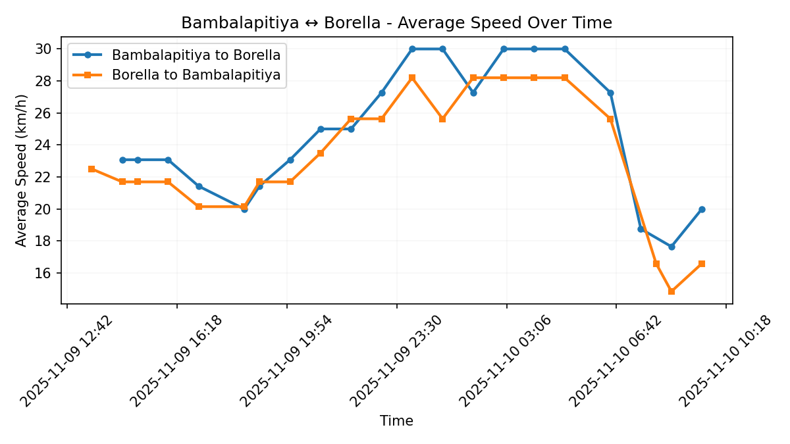
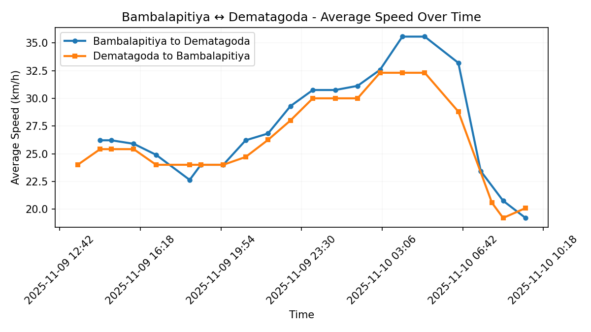
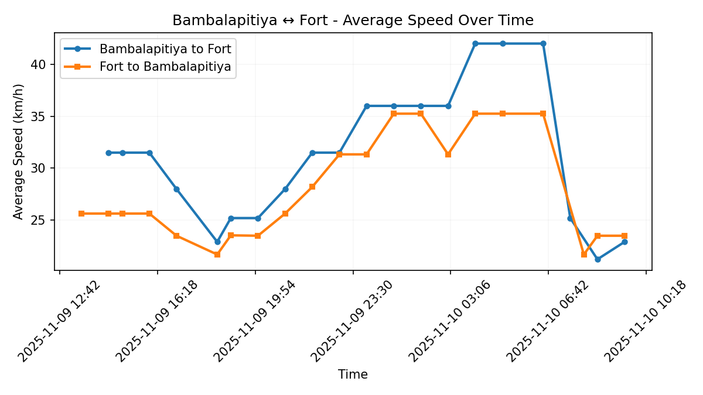
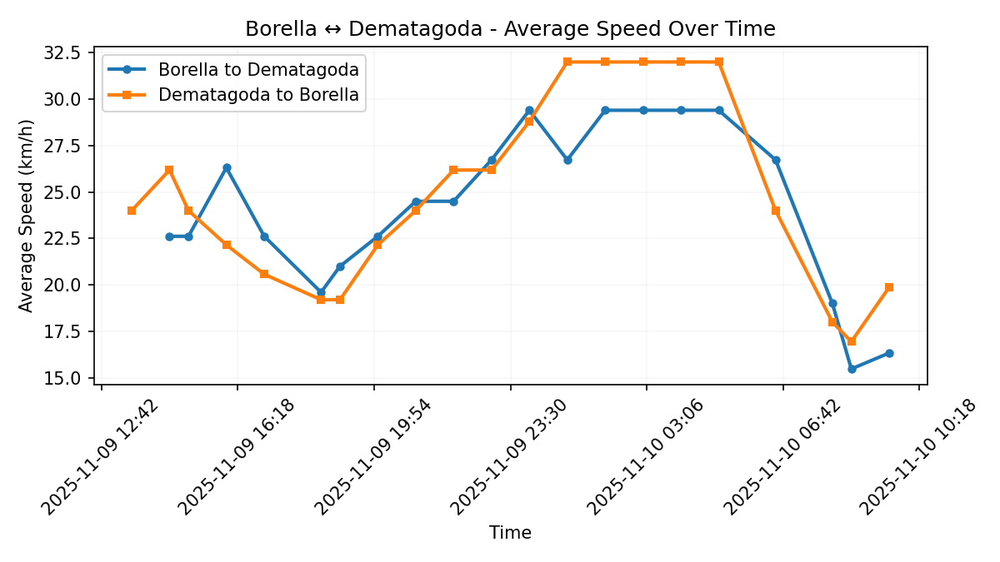
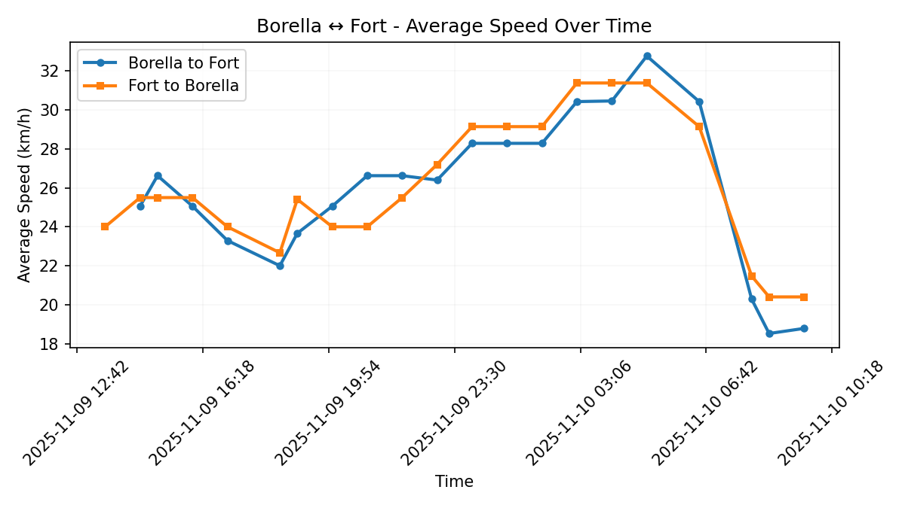
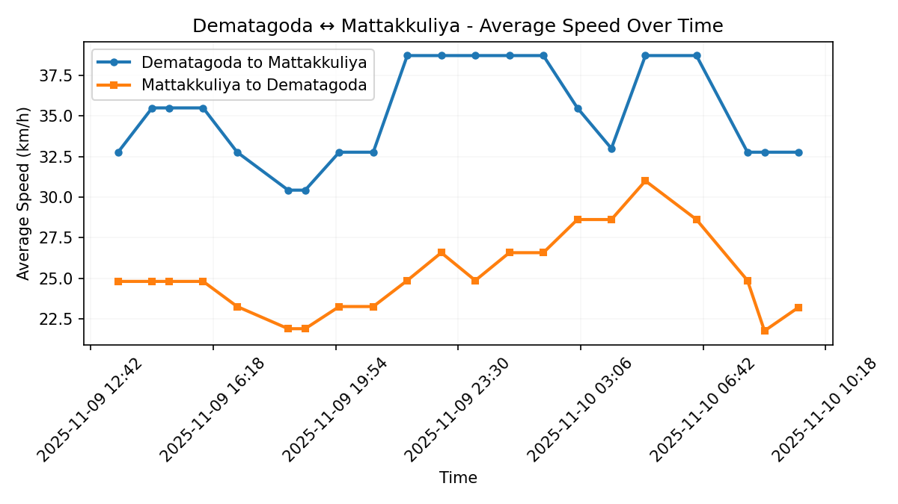
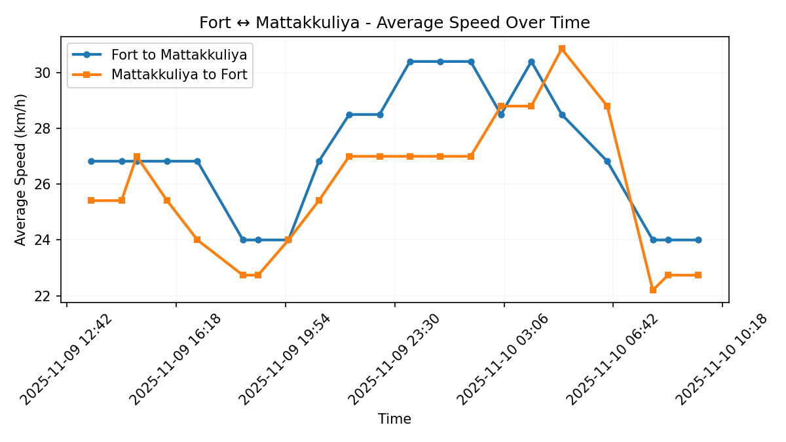

# 🇱🇰 Colombo Traffic Index (cmb_traffic)


## 📊 About This Index

The Colombo Traffic Index (CTI) provides a real-time measure of traffic congestion across key routes within the Colombo Municipal Council (CMC) area by tracking average travel speeds throughout the day. This index is designed primarily for researchers analyzing traffic patterns and urban mobility trends across the city. It also serves policy makers in making data-driven decisions on infrastructure and traffic management.

While the index monitors specific representative routes within the CMC area to establish a general metric for Colombo as a whole, individual commuters may find the detailed route-level data useful for understanding broader traffic patterns, though it is not comprehensive coverage of all routes within the city.

### Methodology

We monitor a set of representative routes across Colombo City, measuring travel times and speeds at regular intervals throughout the day using the Google Maps. 
Each route is monitored in both directions to capture bidirectional traffic patterns, as congestion levels often differ significantly based on travel direction and time of day.

Routes are sampled from Google Maps throughout the day, with travel time, distance, and average speed recorded for each journey. All data is timestamped using Sri Lanka timezone (UTC+5:30), and historical data is accumulated over time to establish reliable baseline patterns for each route.

The overall traffic condition is assessed by calculating the average speed across all monitored routes at each time point. Free-flow speeds are determined from the fastest observed travel times for each route within the last 24 hours, and peak congestion periods are identified by comparing current speeds against these baseline free-flow speeds.

### Travel Time Ratio (TTR)

We also track the **Travel Time Ratio (TTR)** for each route, which measures congestion severity:

```python
TTR = Peak Hour Travel Time / Free Flow Travel Time
    = Free Flow Speed / Peak Hour Speed
```

A TTR of 1.0 indicates free-flow conditions, while higher values indicate increasing congestion. For example, a TTR of 2.0 means travel takes twice as long during peak hours compared to free-flow conditions.

Lower average speeds indicate heavier traffic congestion, while higher speeds suggest free-flow conditions. By tracking these patterns over time, we can identify peak congestion periods and seasonal trends.

## Overall Traffic Index


## Routes

The Traffic Index monitors travel times and speeds across a carefully selected set of routes representing key traffic corridors in Colombo. Each route is tracked in both directions to provide a comprehensive view of traffic conditions throughout the day.

The current version uses routes between the following locations:

- [Bambalapitiya](https://www.google.com/maps/place/6.895572,79.854838/): Bambalapitiya Junction on Galle Road
- [Borella](https://www.google.com/maps/place/6.910883,79.887898/): Ayurveda Junction on Sri Jayewardenepura Mawatha
- [Dematagoda](https://www.google.com/maps/place/6.943176,79.878208/): Southside of Dematagoda Canal Bridge, on A1/Baseline Road
- [Fort](https://www.google.com/maps/place/6.931424,79.842208/): Lotus Road/Galle Face Roundabout
- [Mattakkuliya](https://www.google.com/maps/place/6.980027,79.875513/): Southside of Mattakkuliya Bridge, on New Negombo Road
- [Pamankada](https://www.google.com/maps/place/6.871813,79.884564/): High Level Road border of CMC
- [Wellawatte](https://www.google.com/maps/place/6.863289,79.863608/): Northside of Dehiwala Bridge, on Galle Road

### Route Map

The map below shows all monitored routes connecting these locations:


### 1. [Bambalapitiya ↔ Borella](https://www.google.com/maps/dir/6.895572,79.854838/6.910883,79.887898/)



### 2. [Bambalapitiya ↔ Dematagoda](https://www.google.com/maps/dir/6.895572,79.854838/6.943176,79.878208/)



### 3. [Bambalapitiya ↔ Fort](https://www.google.com/maps/dir/6.895572,79.854838/6.931424,79.842208/)



### 4. [Bambalapitiya ↔ Pamankada](https://www.google.com/maps/dir/6.895572,79.854838/6.871813,79.884564/)


### 5. [Bambalapitiya ↔ Wellawatte](https://www.google.com/maps/dir/6.895572,79.854838/6.863289,79.863608/)


### 6. [Borella ↔ Dematagoda](https://www.google.com/maps/dir/6.910883,79.887898/6.943176,79.878208/)



### 7. [Borella ↔ Fort](https://www.google.com/maps/dir/6.910883,79.887898/6.931424,79.842208/)



### 8. [Borella ↔ Pamankada](https://www.google.com/maps/dir/6.910883,79.887898/6.871813,79.884564/)


### 9. [Borella ↔ Wellawatte](https://www.google.com/maps/dir/6.910883,79.887898/6.863289,79.863608/)


### 10. [Dematagoda ↔ Fort](https://www.google.com/maps/dir/6.943176,79.878208/6.931424,79.842208/)


### 11. [Dematagoda ↔ Mattakkuliya](https://www.google.com/maps/dir/6.943176,79.878208/6.980027,79.875513/)



### 12. [Fort ↔ Mattakkuliya](https://www.google.com/maps/dir/6.931424,79.842208/6.980027,79.875513/)



### 13. [Pamankada ↔ Wellawatte](https://www.google.com/maps/dir/6.871813,79.884564/6.863289,79.863608/)


[](https://opensource.org/licenses/MIT)
