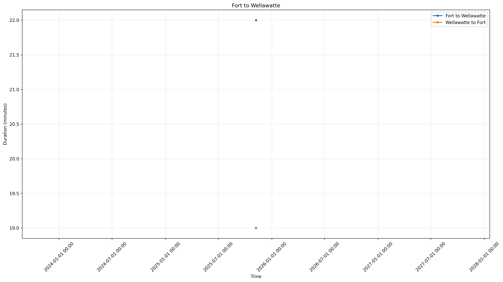
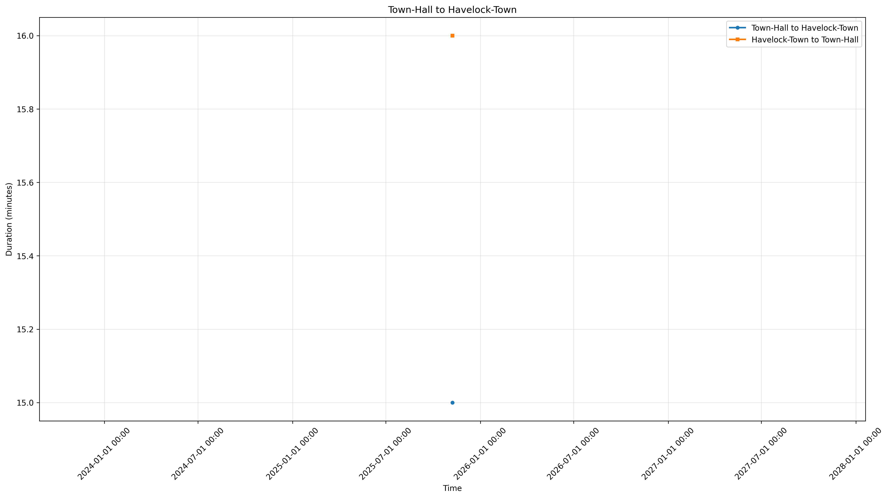
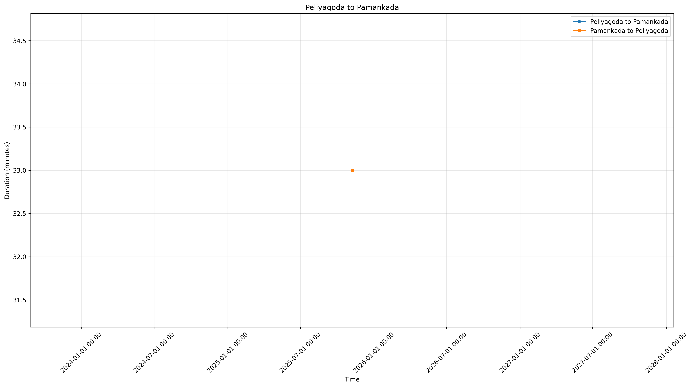
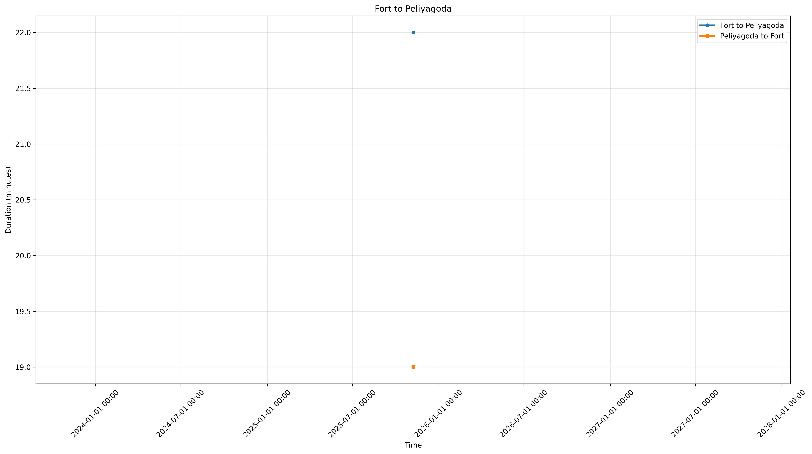
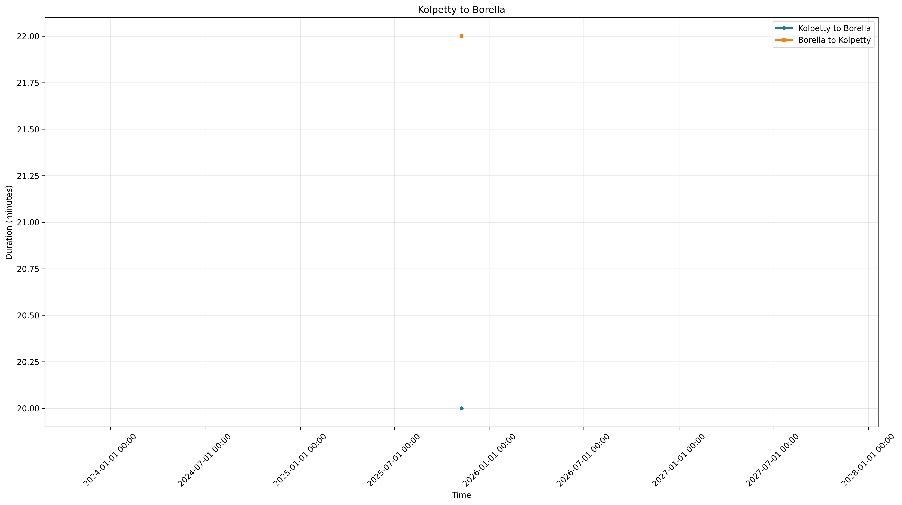
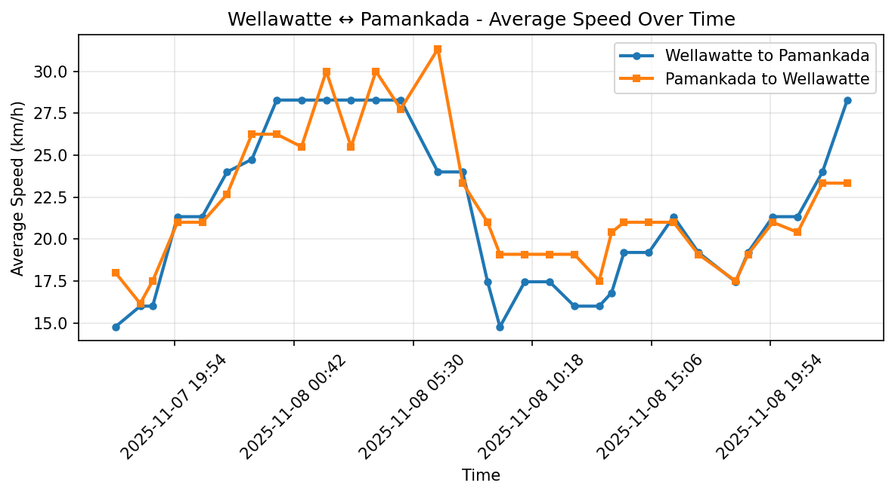

# Colombo Traffic Index (cmb_traffic)


## 📊 About This Index

The Colombo Traffic Index (CTI) provides a real-time measure of traffic congestion across key routes in Colombo. By tracking journey times throughout the day and comparing them to baseline (free-flow) conditions, this index helps:

- 🚗 **Commuters** plan their travel times and avoid peak congestion
- 📈 **Researchers** analyze traffic patterns and urban mobility trends
- 🏛️ **Policy makers** make data-driven decisions on infrastructure and traffic management

### Methodology

We monitor a set of representative routes across Colombo City, measuring travel times at regular intervals throughout the day. The traffic index for each route is calculated as:

```python
Index = Current Travel Time / Minimum Observed Travel Time
```

An index of 1.0 indicates free-flow conditions, while higher values indicate congestion. For example, an index of 2.0 means travel takes twice as long as under ideal conditions.

## Overall Traffic Index


## Routes

### Fort to Wellawatte



### Town-Hall to Havelock-Town



### Peliyagoda to Pamankada



### Fort to Peliyagoda



### Kolpetty to Borella



### Wellawatte to Pamankada


