# 🇱🇰 Colombo Traffic Index (cmb_traffic)

## Definitions, Vision and Big-Picture

See [The Colombo Traffic Index (CTI) - Understanding the Bigger Picture](README.VISION.md)
## Colombo Traffic Index (CTI) = 1.70x

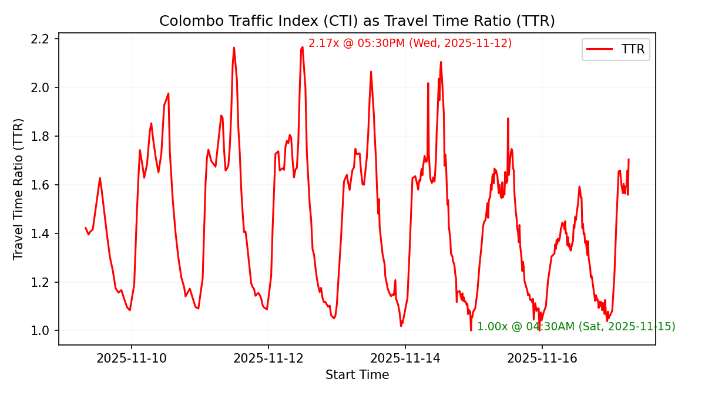

### Average CTI by Time of Day

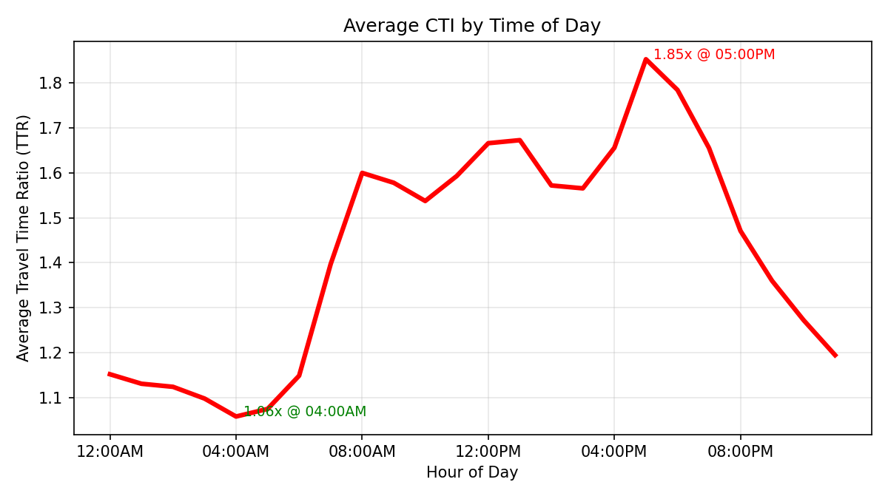

### Average Speed by Day of Week

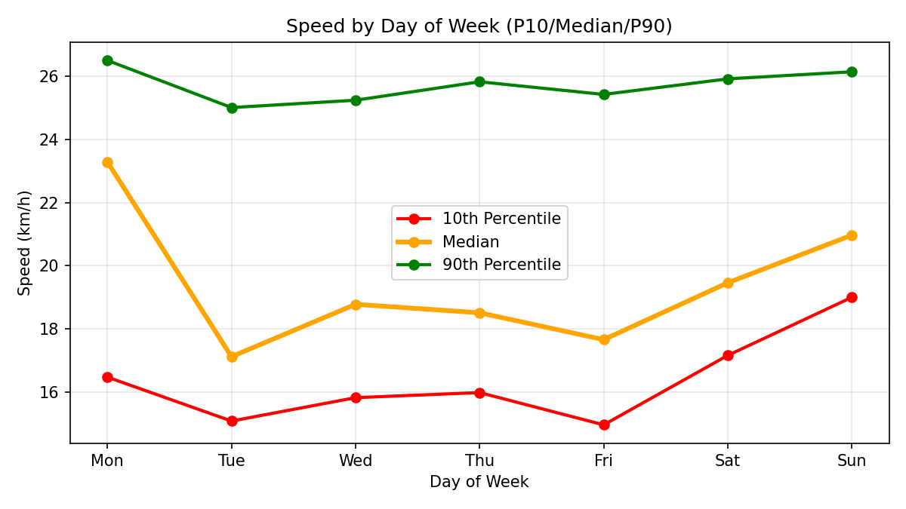

### Overall Direct Speed (ODS)

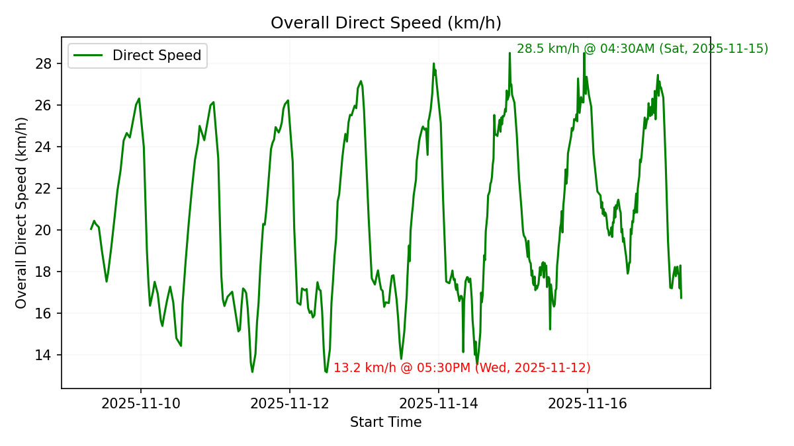

## Routes

The Traffic Index monitors travel times and speeds across a carefully selected set of routes representing key traffic corridors in Colombo. Each route is tracked in both directions to provide a comprehensive view of traffic conditions throughout the day.

The current version uses routes between the following locations:

1. [Mattakkuliya](https://www.google.com/maps/place/6.980032,79.875507/): Southside of Mattakkuliya Bridge, on New Negombo Road (Colombo 15)
2. [Dematagoda](https://www.google.com/maps/place/6.943065,79.878269/): Southside of Dematagoda Canal Bridge, on A1/Baseline Road (Colombo 9)
3. [Fort](https://www.google.com/maps/place/6.931424,79.842208/): Lotus Road/Galle Face Roundabout (Colombo 1)
4. [Borella](https://www.google.com/maps/place/6.910838,79.887858/): Ayurveda Junction on Sri Jayewardenepura Mawatha (Colombo 8)
5. [Bambalapitiya](https://www.google.com/maps/place/6.895575,79.854851/): Bambalapitiya Junction on Galle Road (Colombo 4)
6. [Pamankada](https://www.google.com/maps/place/6.871813,79.884564/): High Level Road border of CMC (Colombo 6)
7. [Wellawatte](https://www.google.com/maps/place/6.863366,79.863589/): Northside of Dehiwala Bridge, on Galle Road (Colombo 6)

### Route Map

The map below shows all monitored routes connecting these locations:

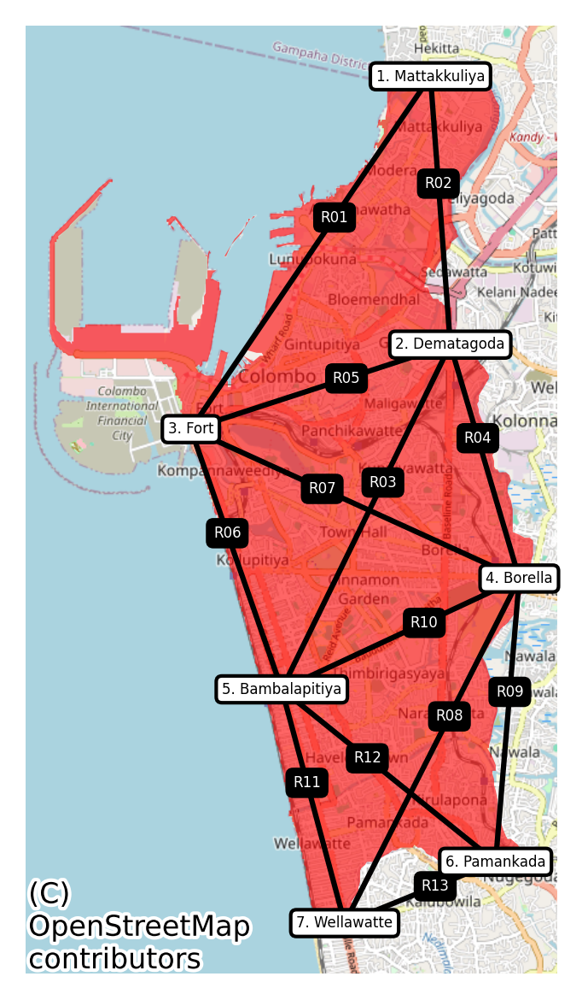

### Direct Speed by Route

#### R01. [Mattakkuliya ↔ Fort](https://www.google.com/maps/dir/6.980032,79.875507/6.931424,79.842208/)

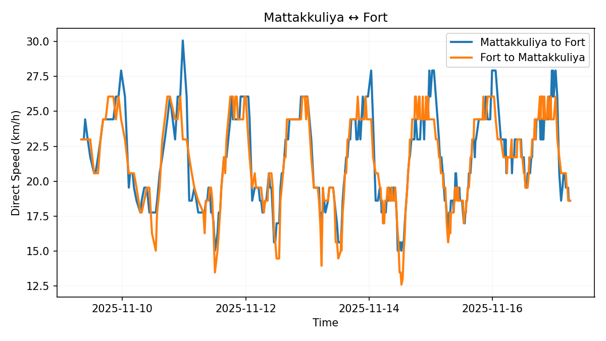

#### R02. [Mattakkuliya ↔ Dematagoda](https://www.google.com/maps/dir/6.980032,79.875507/6.943065,79.878269/)

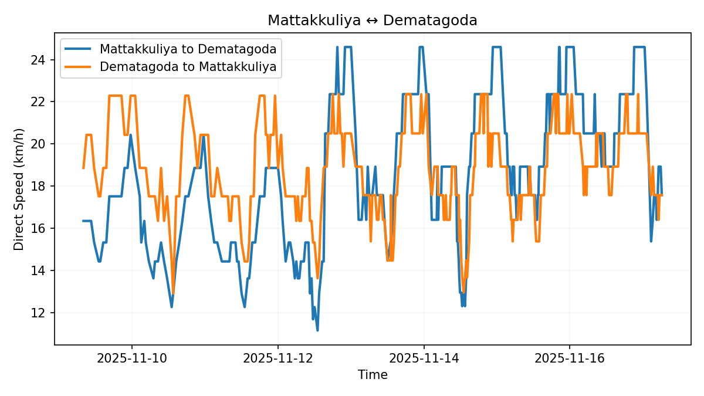

#### R03. [Dematagoda ↔ Bambalapitiya](https://www.google.com/maps/dir/6.943065,79.878269/6.895575,79.854851/)

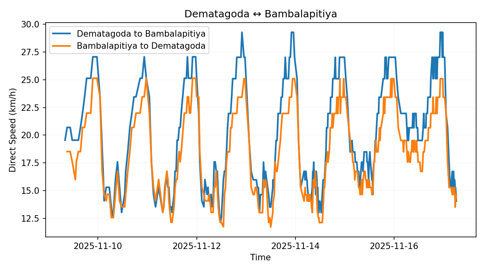

#### R04. [Dematagoda ↔ Borella](https://www.google.com/maps/dir/6.943065,79.878269/6.910838,79.887858/)

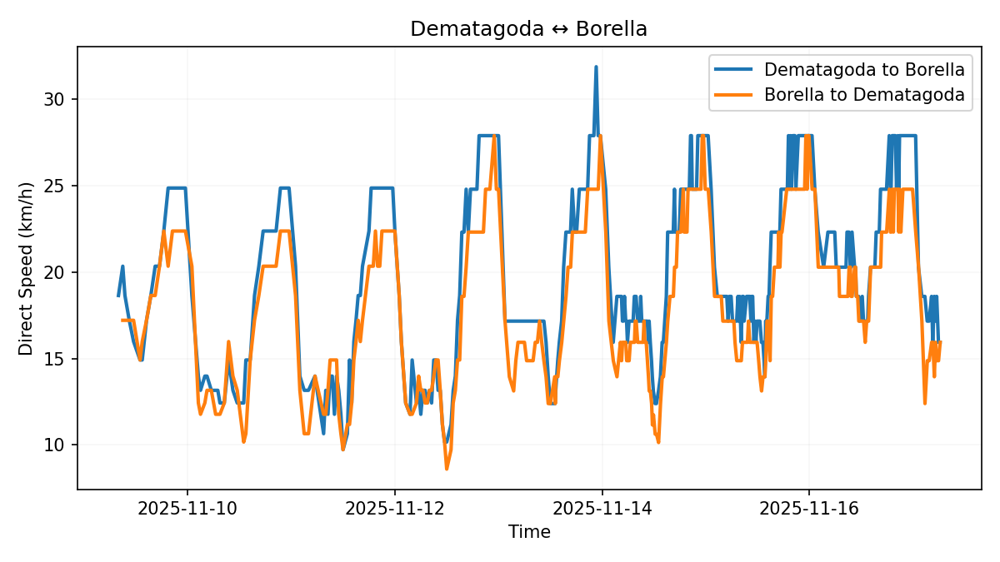

#### R05. [Dematagoda ↔ Fort](https://www.google.com/maps/dir/6.943065,79.878269/6.931424,79.842208/)

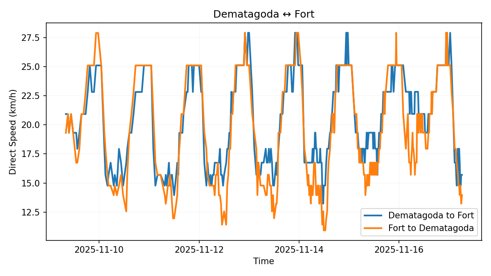

#### R06. [Fort ↔ Bambalapitiya](https://www.google.com/maps/dir/6.931424,79.842208/6.895575,79.854851/)

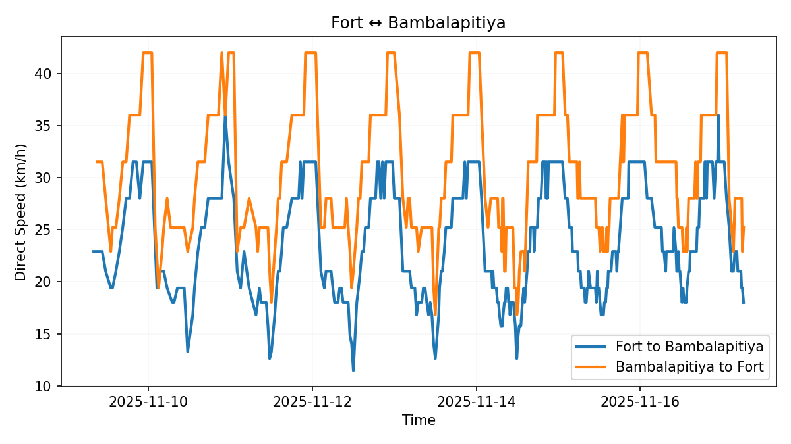

#### R07. [Fort ↔ Borella](https://www.google.com/maps/dir/6.931424,79.842208/6.910838,79.887858/)

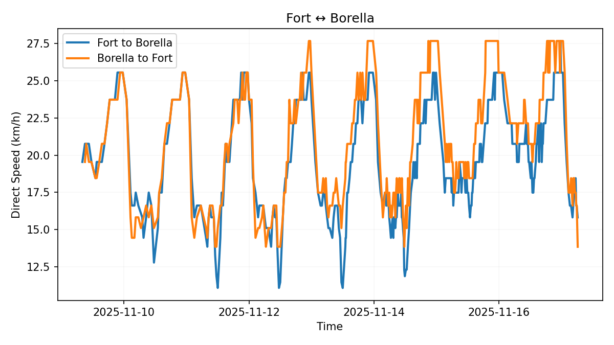

#### R08. [Borella ↔ Wellawatte](https://www.google.com/maps/dir/6.910838,79.887858/6.863366,79.863589/)

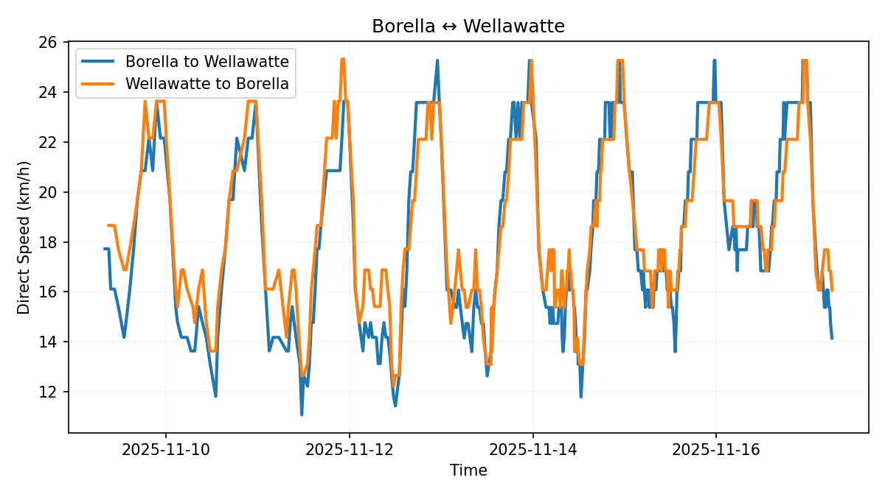

#### R09. [Borella ↔ Pamankada](https://www.google.com/maps/dir/6.910838,79.887858/6.871813,79.884564/)

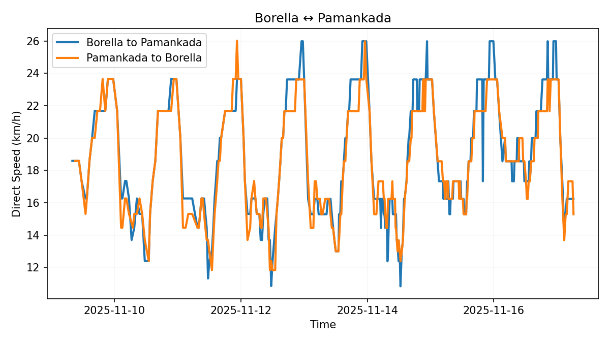

#### R10. [Borella ↔ Bambalapitiya](https://www.google.com/maps/dir/6.910838,79.887858/6.895575,79.854851/)

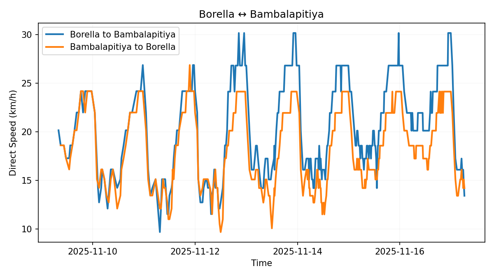

#### R11. [Bambalapitiya ↔ Wellawatte](https://www.google.com/maps/dir/6.895575,79.854851/6.863366,79.863589/)

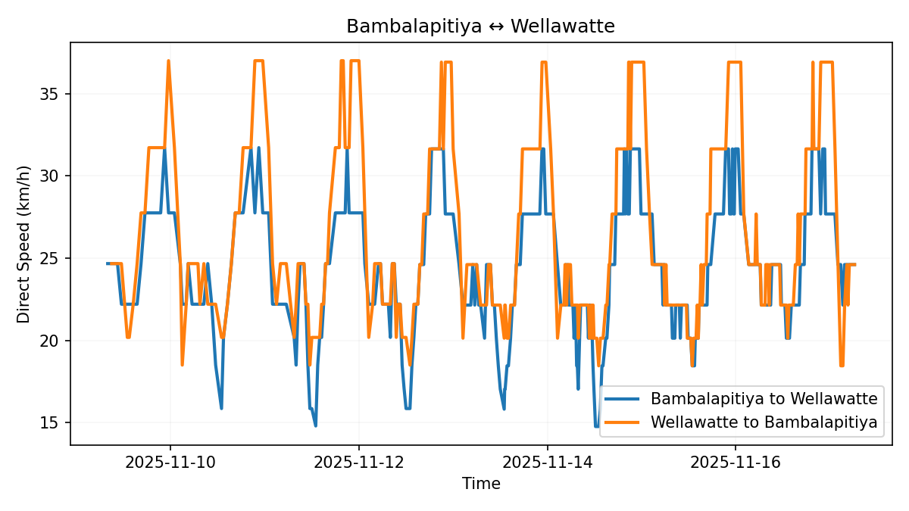

#### R12. [Bambalapitiya ↔ Pamankada](https://www.google.com/maps/dir/6.895575,79.854851/6.871813,79.884564/)

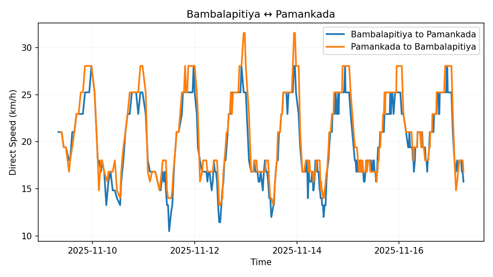

#### R13. [Pamankada ↔ Wellawatte](https://www.google.com/maps/dir/6.871813,79.884564/6.863366,79.863589/)

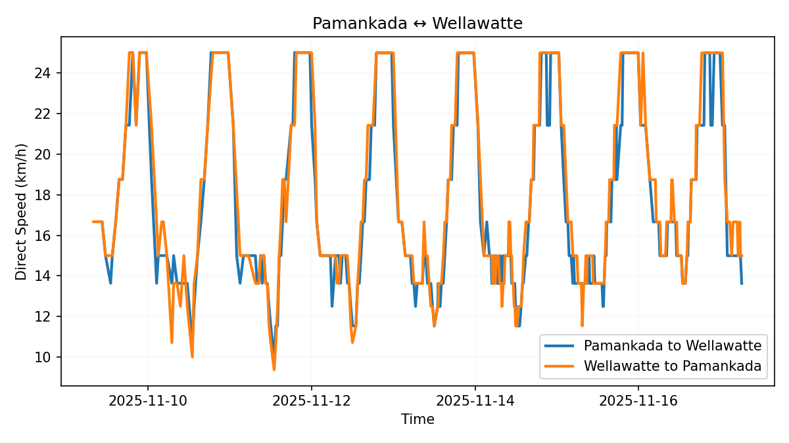

